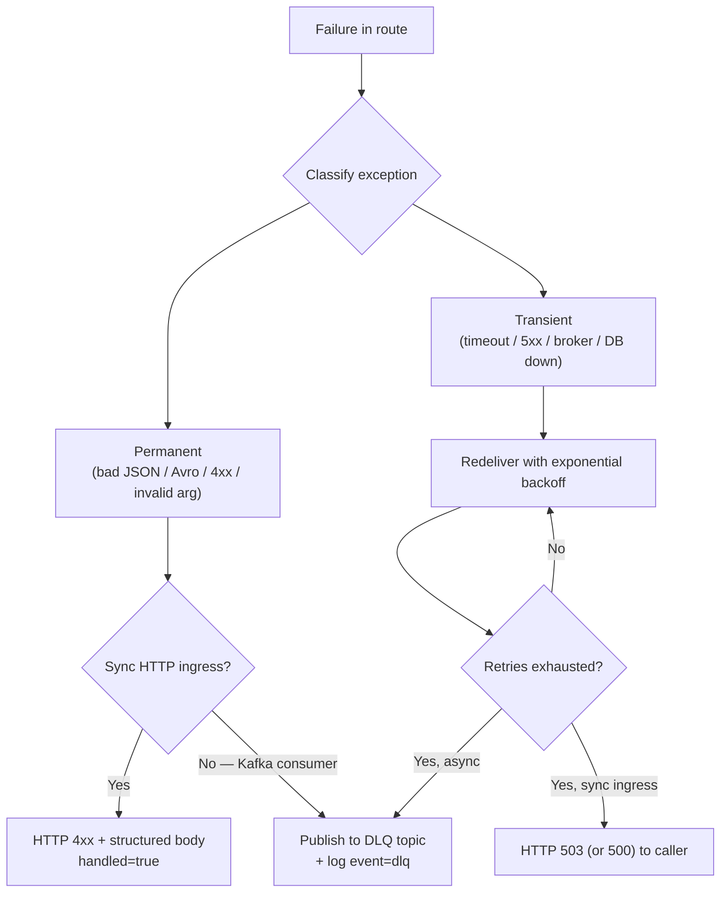
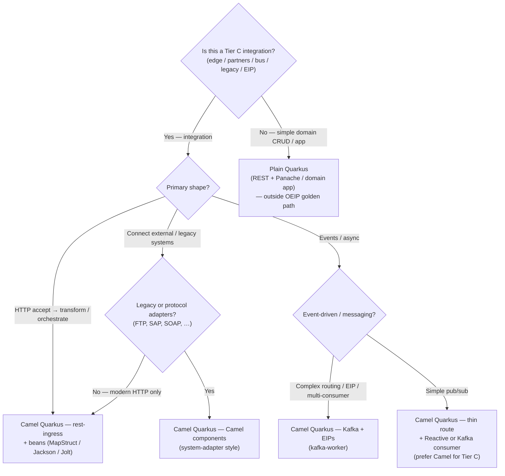

# Integration Patterns

## Document Purpose
This document defines the mandatory coding standards and architectural patterns for all Tier C (Customer-Owned) integrations built on the Platform. It ensures that domain teams produce maintainable, testable, and resilient integration services that align with the platform's distributed, stateless nature.

---

## 1. The "Thin Routes" Principle

### Statement
Domain teams must adhere to the rule of "Thin Routes" when developing integrations. The integration framework (Apache Camel) must be used exclusively for routing, mediation, data transformation, orchestration, and error handling. This logic resides within the **Integration Layer**.

### Rationale
Historically, integration developers have embedded complex business logic, database lookups, and domain validations directly into the integration DSL (Domain Specific Language). This "Fat Route" anti-pattern creates unmaintainable, monolithic spaghetti code that is extremely difficult to unit-test and impossible to reuse.

### Implications
* **Separation of Concerns:** Complex business rules and heavy domain logic must be encapsulated within dedicated Quarkus microservices (e.g., standard Java classes or CDI beans) residing in the **Processing Layer**.
* **Delegation:** The Camel route should simply receive the payload, pass it to the Quarkus bean for business processing, and route the result.
* **Prohibited Patterns:** Placing thousands of lines of business logic, complex if/else trees, or inline SQL queries directly into a Camel route is classified as a severe anti-pattern that degrades platform maintainability.

---

## 2. Mandatory Enterprise Integration Patterns (EIP)

The platform supports both synchronous APIs and asynchronous event streams. Because these paradigms fail in fundamentally different ways, domain teams must apply the correct resilience patterns specific to the communication style.

### 2.1. Patterns for Synchronous Communication (REST / gRPC)
Synchronous calls block threads and expect immediate responses. They are highly vulnerable to network latency and cascading failures.
* **Protocol Neutrality:** Following the Microservices Manifesto, all external synchronous communication must be routed through the Edge Layer (API Gateway).
* **Strict Timeouts:** Every outgoing synchronous request *must* have a hard timeout configured. Infinite waiting (hanging threads) is strictly prohibited as it leads to platform resource exhaustion.
* **Circuit Breaker:** Any call to an external API must be wrapped in a Circuit Breaker (e.g., via Resilience4j). If the downstream service is failing or timing out repeatedly, the circuit opens to fail fast and protect the platform.
* **Fallback Pattern:** When a Circuit Breaker opens, the route should gracefully degrade by implementing a fallback mechanism (e.g., returning cached data or a standardized `HTTP 503 Service Unavailable` response).

### 2.2. Patterns for Asynchronous Communication (Kafka / RabbitMQ)
Asynchronous communication relies on decoupled queues and topics (the **Event / Messaging Layer**), making it highly scalable but vulnerable to poison pills (malformed messages).
* **Kafka Topics:** Must follow the naming convention `[domain].[entity].[event-type].[version]`.
* **Dead Letter Queue (DLQ):** Messages must never be dropped silently. If a message cannot be processed after a configured number of retries, it must be routed to a centralized DLQ topic/queue with its original headers and error stack trace intact.
* **Outbox Pattern (Transactional Outbox):** When an integration needs to update a local database and publish an event to Kafka, teams must avoid dual-write inconsistencies by using the Outbox Pattern (e.g., writing to a local table and relying on a log-tailing connector like Debezium to publish the event).

### 2.3. Universal Retry Policies
* **Transient vs. Permanent:** Integrations must inspect error codes. Transient errors (e.g., `HTTP 503`, network timeouts) trigger an exponential backoff retry. Permanent errors (e.g., `HTTP 400 Bad Request`, invalid JSON) must *never* be retried and should immediately fail or route to a DLQ.

### 2.4. Error handling in Camel Quarkus (reference)

Policy above is mandatory. In Camel Quarkus it is implemented with **`onException`** (classify failures) + **`errorHandler` / Dead Letter Channel** (retries then DLQ) — not ad-hoc `try/catch` scattered through fat processors.

| Concern | Camel mechanism | Rule |
|---------|-----------------|------|
| Default async path | `errorHandler(deadLetterChannel("kafka:…dlq…"))` + `maximumRedeliveries` + exponential backoff | Exhausted → **DLQ**, never silent drop |
| Permanent errors | `onException(…Permanent…).maximumRedeliveries(0).handled(true)` then DLQ or HTTP 4xx | **No** retry loop on poison pills |
| Sync ingress mapping | `onException(JsonProcessingException…).handled(true)` → `400` | Client can fix and retry |
| Sync ingress broker blip | Limited redelivery, then `503` | Client / edge retries later |
| Egress HTTP | `circuitBreaker()` + `onFallback` (timeout required) | Fail fast; optional degrade |
| Idempotency | Durable key (DB unique / Redis) + optional Camel `idempotentConsumer` | At-least-once safe |
| Observability | Log `service=… event=error\|dlq correlationId=…` + keep original headers on DLQ | Lens A + alert on DLQ depth |

**Reference code (copy shape, not business):**
* Sync ingress EH — `platform-iac-core/examples/lite-demo/orders-api` (`OrdersApiRoutes`)
* Async consumer + Kafka DLQ + durable idempotency — `…/orders-worker` (`OrdersWorkerRoutes`)
* Template skeleton (DLQ + egress CB) — `platform-iac-core/templates/quarkus-camel-app` (`EngineRouter`)

DLQ topic naming: `{domain}.{entity}.dlq.v1` (demo: `orders.created.dlq.v1`) or tenant-wide `system.poison-pill.dlq.v1` — one style per tenant.

---

## 3. Idempotency by Default

### Statement
All asynchronous event consumers deployed on the platform must be strictly idempotent. Processing the exact same message once, twice, or a hundred times must result in the same final system state.

### Rationale
Modern event-driven architectures (like Apache Kafka or RabbitMQ) guarantee "at least once" delivery. Network partitions, consumer rebalances, or platform restarts mean that duplicate messages *will* occur. Without idempotency, a duplicate message could result in critical business errors (e.g., billing a customer twice).

### Implications
* **Idempotency Keys:** Every incoming message must have a unique identifier (e.g., `Correlation-ID` or `Order-ID`).
* **Implementation:** Prefer a **durable** idempotency key in the **Persistence Layer** (e.g., `UNIQUE(correlation_id)` + `ON CONFLICT DO NOTHING`, or Redis / Camel `JdbcMessageIdRepository`). In-memory Camel `idempotentConsumer` is only for local labs. See lite-demo `orders-worker` for the durable SQL pattern.

---

## 4. Distributed Transactions and State (The Saga Pattern)

### Statement
The core integration execution engines must remain completely stateless. Two-Phase Commit (2PC) and distributed XA transactions are strictly prohibited on the platform due to performance bottlenecks.

### Execution
When an integration workflow spans multiple independent microservices or APIs (e.g., deducting funds and reserving inventory), domain teams must implement the **Saga Pattern**.
* **Compensating Actions:** Every distinct operation must have a corresponding Compensating Action (e.g., if "Reserve Inventory" fails, the route must invoke "Refund Funds").
* **State Delegation:** Long-running processes and stateful sagas should be delegated to dedicated Workflow & State engines or coordinated via Camel's native Saga EIP.

---

## 5. Large Payload Handling (The Claim Check Pattern)

### Statement
The integration platform is designed for high-throughput message routing, not file storage. Passing massive payloads (e.g., 50MB PDFs, large video files) directly through the message broker or holding them in Camel's working memory will cause Out-Of-Memory (OOM) errors and impact platform stability.

### Execution
Domain teams must use the **Claim Check Pattern** for any payload exceeding a predefined threshold (e.g., 5MB).
1. The large payload is stored in an external object store (e.g., AWS S3, Azure Blob Storage).
2. The integration platform only processes and routes a lightweight reference message (the "Claim Check" URL or ID).
3. The final consuming system uses the reference to download the heavy payload directly from the object store.

---

## 6. Security and Data Masking

### Statement
Personally Identifiable Information (PII), Payment Card Industry (PCI) data, and secrets must never be exposed in platform logs or tracing systems.

### Execution
* **Log Masking:** Domain teams must utilize native Log Masking features to obfuscate sensitive fields (e.g., `password=***`, `credit_card=***`) before they are flushed to standard output or the observability stack.
* **Secure Enclaves for Secrets:** Secrets and API tokens must never be hardcoded or logged; they must be dynamically fetched via the platform's secrets management integration within the **Security & Identity Layer** (e.g., Vault).

---

## 7. Camel Quarkus vs plain Quarkus (decision guide)

### Statement
**Tier C integrations** on this platform use **Apache Camel on Quarkus (Camel Quarkus)** as the golden path: thin Camel routes for mediation/EIP, Quarkus CDI beans for domain logic and non-trivial mapping.  
**Plain Quarkus** (no Camel) is for ordinary domain microservices that are *not* platform integrations (simple CRUD, internal APIs without edge/bus/legacy connectors).

Do **not** drop Camel only because a flow has “heavy if/else” — put that logic in beans and keep a thin route.

### Decision flow

### Mapping cheat sheet

| Situation | Choose | Where logic lives |
|-----------|--------|-------------------|
| Partner HTTP → platform | Camel Quarkus (`rest-ingress`) | Route thin; mapping/rules in CDI beans |
| Structural JSON reshape | Camel Quarkus | Jolt / DataSonnet / MapStruct **in beans**, not a fat DSL |
| Heavy business if/else | Camel Quarkus | Quarkus beans — **not** “switch to plain Quarkus” |
| FTP / SAP / SOAP / odd protocols | Camel Quarkus + components | Thin adapter route |
| Kafka facts + enrich/persist | Camel Quarkus (`kafka-worker`) | EIP + idempotency in route; domain in beans |
| Domain CRUD with no integration story | Plain Quarkus | Outside Tier C template |

Scaffold: platform Camel Quarkus template (see [Golden Path](./01-golden-path-and-cicd.md)). Internal archetypes: platform architecture notes for Camel building blocks.
